This project is a quick start guide about how to learn and understand Redux

# This program targets:

## 1st: UI target of this project
This is the target UI of our project:
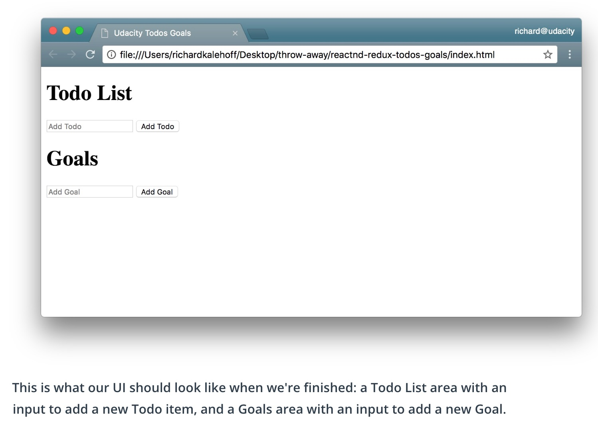

## 2nd: Deny task related to 'bitcoin'

Identificates when any of the text inputed in the field contains the word 'bitcoin', does not registers it and shows a message. 
Don't let add anything with the word 'bitcoin'.

## Redux -> Predictable
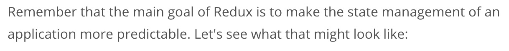

## Store / State tree

### The store should have 4 parts:
1. The state
1. Get the state
1. Listen to change on the state
1. Update the state (dispatch function)

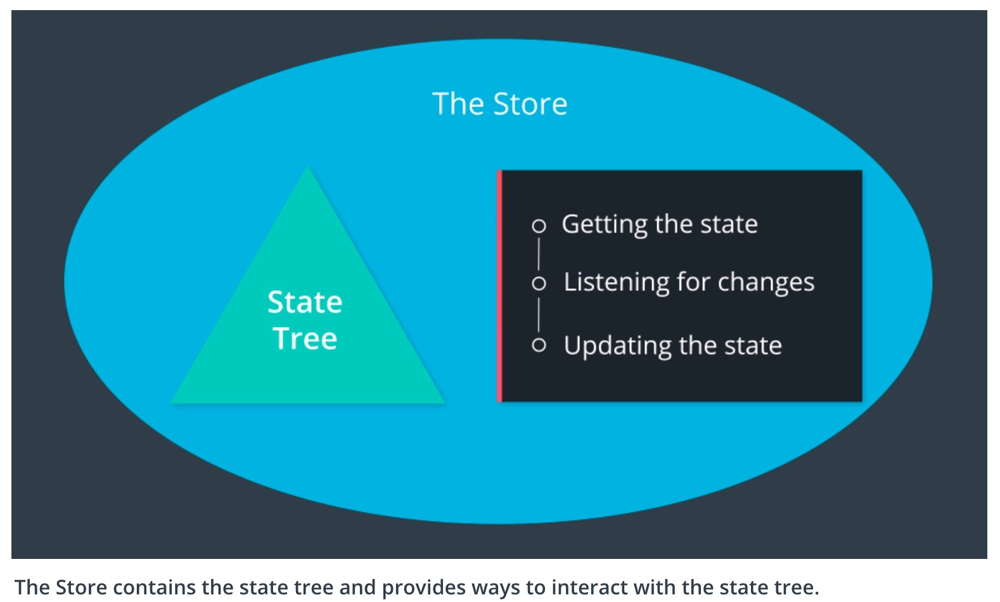

## Action

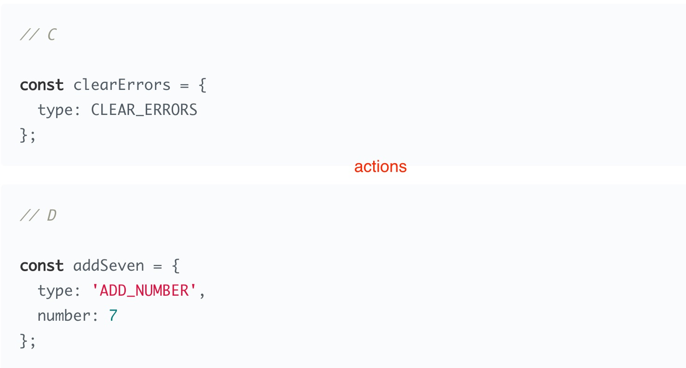

## Reducer

### Pure Function

*Take an state end reduce it to a new brand state*

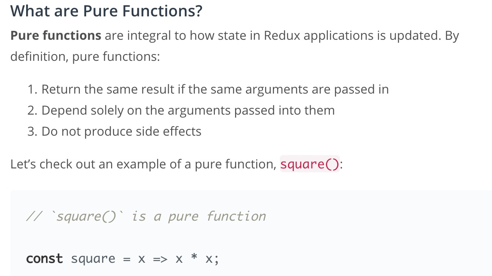

## Action Creator

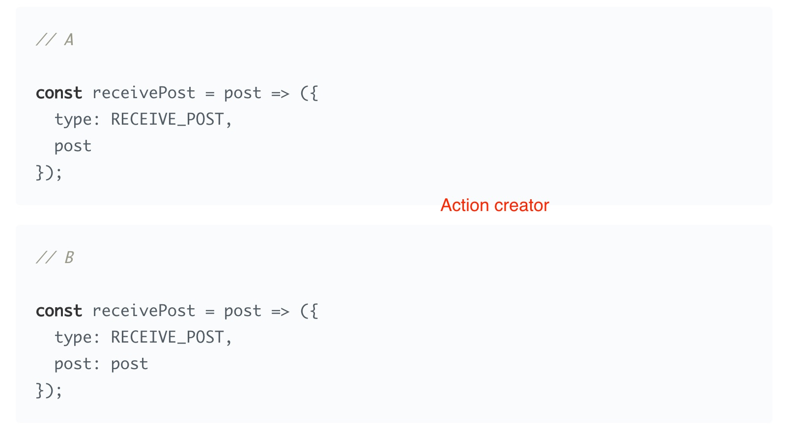

## Middleare (Redux)

The Redux docs describe [middleware](https://redux.js.org/advanced/middleware) as:

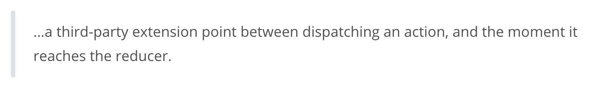

### Redux middleware properties

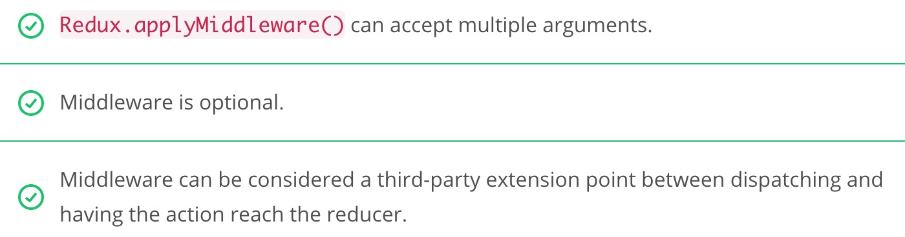

### Operations that a middleware can do before passing the action along to the reducer:

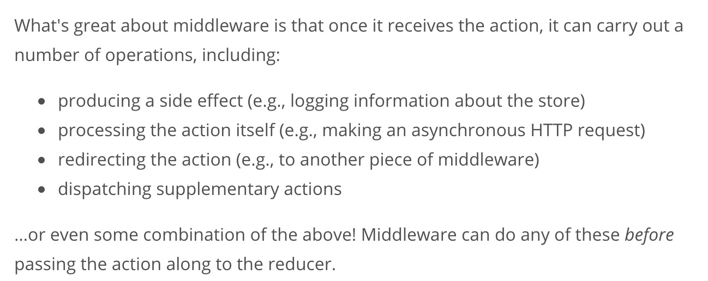

### How to use Redux middlewares:

```js
const store = Redux.createStore( <reducer-function>, <middleware-functions> )
```

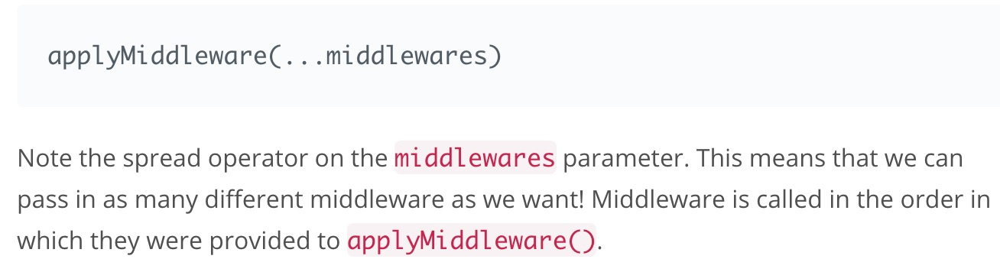

## [Hight-Order Functions](https://www.udacity.com/course/object-oriented-javascript--ud711)

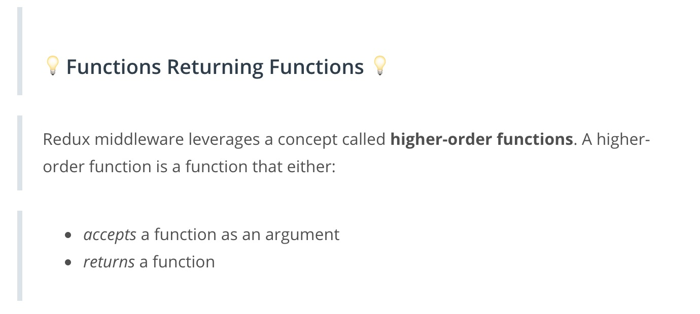