This project is a quick start guide about how to learn and understand Redux

# This program targets:

## 1st: UI target of this project
This is the target UI of our project:
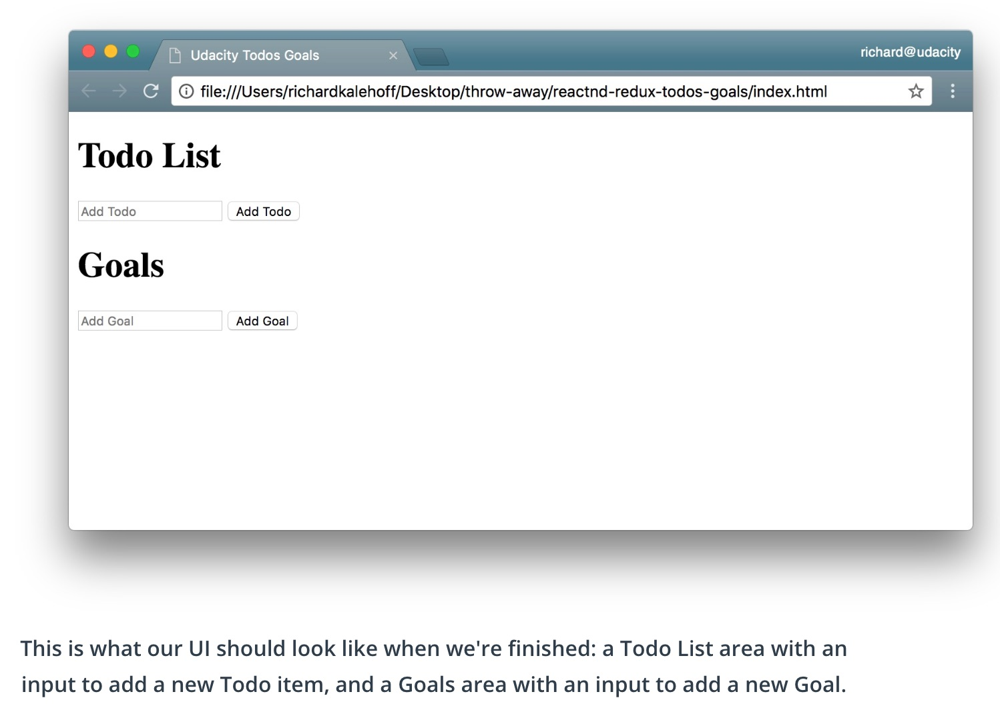

## These are the main functionalities:
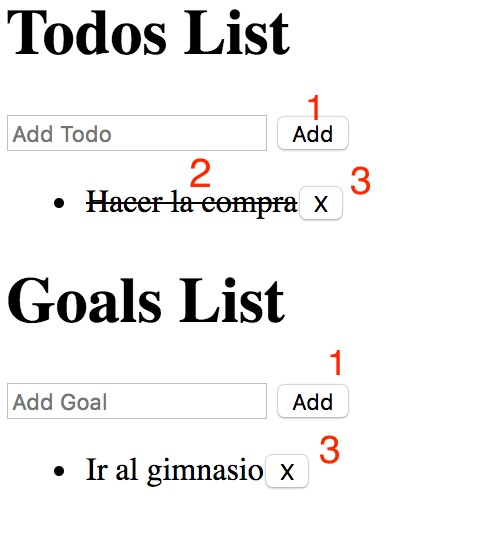

1. Add task to list (todo or goal)
1. Mark task as completed (onlye todo)
1. Delete task from list (todo or goal)

## 2nd: Deny task related to 'bitcoin' (checker middleware)

Identificates when any of the text inputed in the field contains the word 'bitcoin', does not registers it and shows a message. 
Don't let add anything with the word 'bitcoin'.

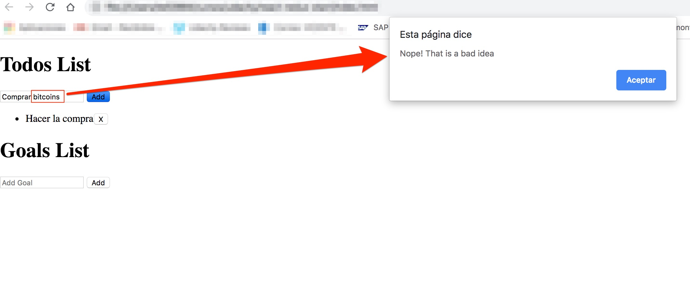

## 3rd: Generate console logs per action type (Logger middleware)

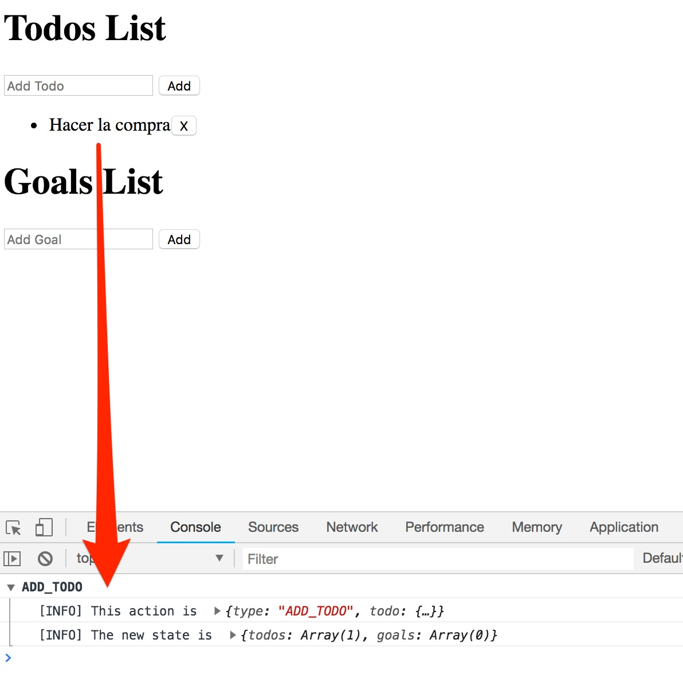

## Redux -> Predictable


## Store / State tree

### The store should have 4 parts:
1. The state
1. Get the state
1. Listen to change on the state
1. Update the state (dispatch function)

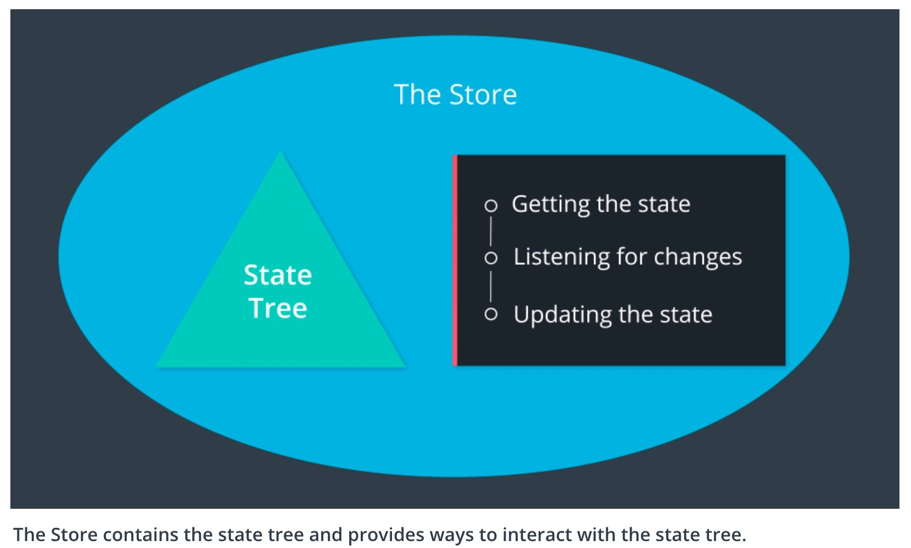

## Action

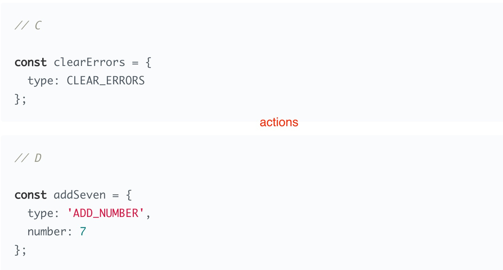

## Reducer

### Pure Function

*Take an state end reduce it to a new brand state*


## Action Creator

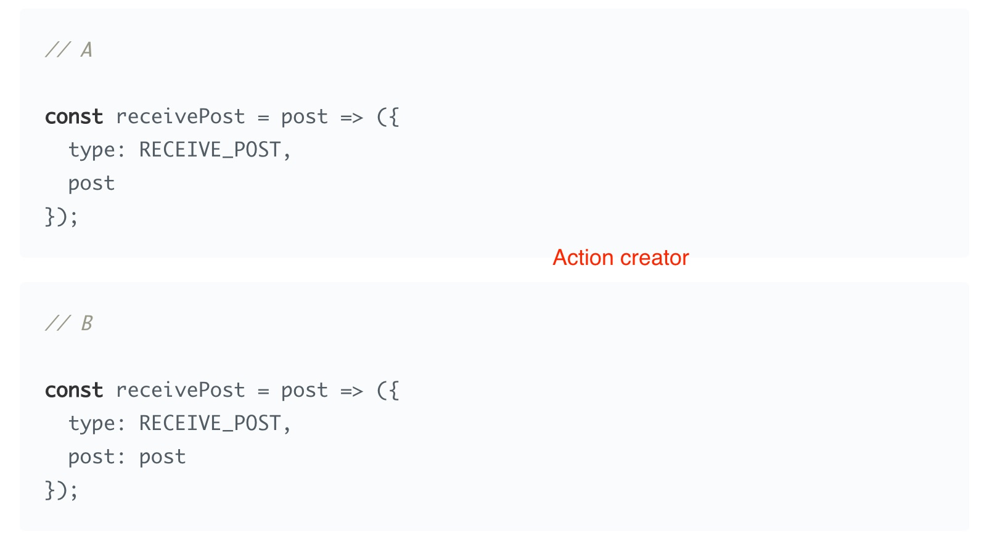

## Middleare (Redux)

The Redux docs describe [middleware](https://redux.js.org/advanced/middleware) as:


### Redux middleware properties

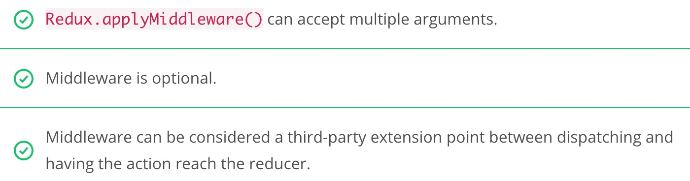

### Operations that a middleware can do before passing the action along to the reducer:

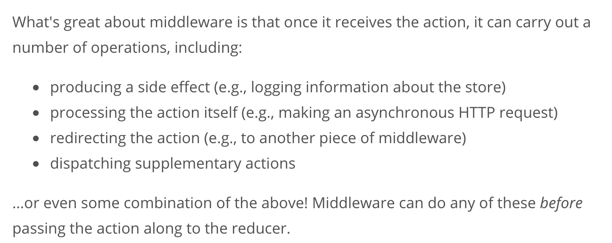

### How to use Redux middlewares:

```js
const store = Redux.createStore( <reducer-function>, <middleware-functions> )
```

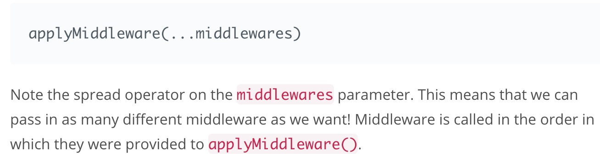

## [Hight-Order Functions](https://www.udacity.com/course/object-oriented-javascript--ud711)

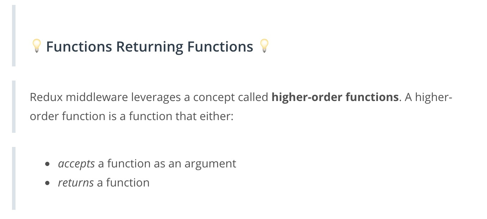

# [REF](https://reactjs.org/docs/refs-and-the-dom.html#callback-refs)

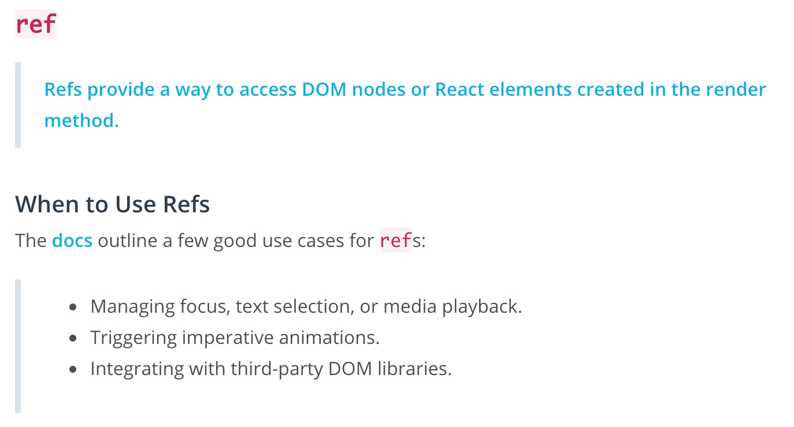

React will call the ref callback with the DOM element when the component mounts, and call it with null when it unmounts. Refs are guaranteed to be up-to-date before `componentDidMount` or `componentDidUpdate` fires.

# Note abput methos

## componentDidMount

[componentDidMount()](https://reactjs.org/docs/react-component.html#componentdidmount) is invoked immediately after a component is mounted (inserted into the tree)...If you need to load data from a remote endpoint, this is a good place to instantiate the network request.

## forceUpdate

By default, when your component’s state or props change, your component will re-render. If your render() method depends on some other data, you can tell React that the component needs re-rendering by calling [forceUpdate()](https://reactjs.org/docs/react-component.html#forceupdate).

Calling [forceUpdate()](https://reactjs.org/docs/react-component.html#forceupdate) will cause render() to be called on the component, skipping shouldComponentUpdate(). This will trigger the normal lifecycle methods for child components, including the shouldComponentUpdate() method of each child. React will still only update the DOM if the markup changes.


# Thunk ([redux-thunk-library](https://github.com/gaearon/redux-thunk))

## Benefits of Thunks
Out of the box, the Redux store can only support the synchronous flow of data. Middleware like thunk helps support asynchronicity in a Redux application. You can think of thunk as a wrapper for the store’s dispatch() method; rather than returning action objects, we can use thunk action creators to dispatch functions (or even or Promises).

Without thunks, synchronous dispatches are the default. We could still make API calls from React components (e.g., using the componentDidMount() lifecycle method to make these requests) -- but using thunk middleware gives us a cleaner separation of concerns. Components don't need to handle what happens after an asynchronous call, since API logic is moved away from components to action creators. This also lends itself to greater predictability, since action creators will become the source of every change in state. With thunks, we can dispatch an action only when the server request is resolved!

## Thunk flow


## React Context

[Context](https://reactjs.org/docs/context.html#reactcreatecontext) provides a way to pass data through the component tree without having to pass props down manually at every level.

`See this project example`: [React Context](https://github.com/vicmonmena/udacity-react-redux-context)

## [Container/Connected component `VS` Presentational Component]https://medium.com/@dan_abramov/smart-and-dumb-components-7ca2f9a7c7d0)

### Container/Connected component
A connected component is connected to the Redux store and is responsible for getting data from the store.

### Presentational Component
A presentational component should not access the store. It should receive any information it needs as props and then just render a UI.